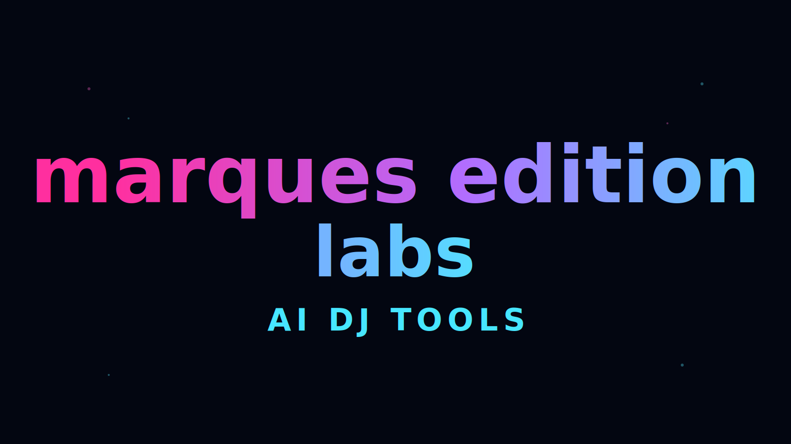
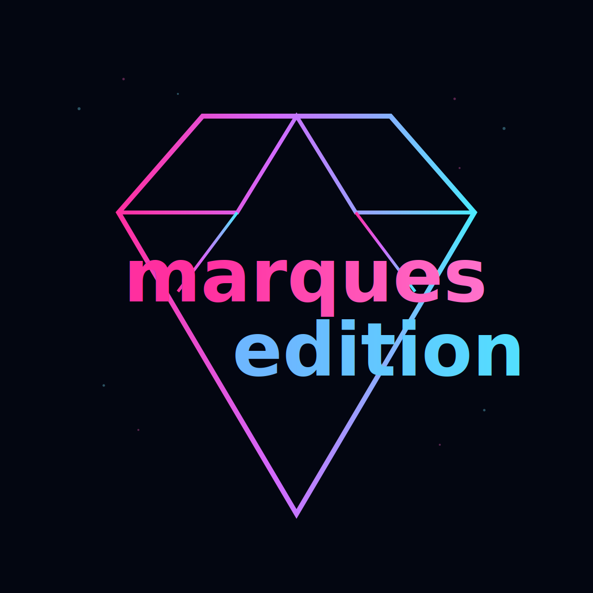

<div align="center">
  
</div>

<div align="center">

[](https://github.com/marqueseditionlabs)


</div>

## Executive Profile

I am **Alejandro Lopez Aragon**, CEO of **Marques Edition Labs**.
I lead product strategy and technical execution for AI-powered software built for DJs and music operations.

## Visual Direction (Neon CSS System)

```css
:root {
  --bg-deep: #030611;
  --pink-neon: #ff2f9f;
  --violet-neon: #b26dff;
  --cyan-neon: #4ce9ff;
  --blue-ice: #74b4ff;
}

.neon-glow {
  text-shadow: 0 0 8px var(--pink-neon), 0 0 16px var(--cyan-neon);
}
```

<div align="center">
  
</div>

## What I Build

- AI-assisted tools for DJ session planning
- macOS workflow automation for Apple Music operations
- production-ready apps with strong architecture and release discipline

## Technologies I Control

<table>
<tr>
<td valign="top" width="33%">

### Languages
- Swift
- AppleScript
- Shell

</td>
<td valign="top" width="33%">

### Frameworks
- SwiftUI
- AppKit integration
- OpenAI API

</td>
<td valign="top" width="33%">

### Delivery
- GitHub Actions
- CI/CD pipelines
- QA hardening

</td>
</tr>
</table>

## Flagship Product

### [MARQUESEDITION_TOOLS](https://github.com/marqueseditionlabs/MARQUESEDITION_TOOLS)

- **FolderToTunes** (`Stable`): folder-to-Apple Music structure import
- **AISessionGenerator** (`Beta`): AI-assisted playlist/session generation workflow

## Engineering DNA

- domain-driven ownership (`Common`, `FolderToTunes`, `AISessionGenerator`)
- predictable state transitions and resilient workflows
- practical product decisions with direct business impact

## Links

- Personal GitHub: [@marquesedition](https://github.com/marquesedition)
- Organization: [@marqueseditionlabs](https://github.com/marqueseditionlabs)
- LinkedIn: [alejandrolopezaragon](https://www.linkedin.com/in/alejandrolopezaragon/)

<div align="center">


</div>
